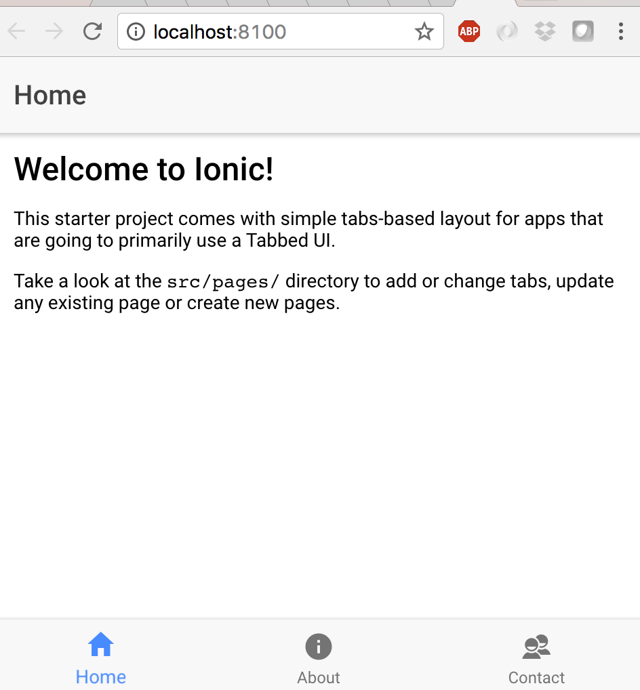

# Week 6: Mobile Applications using Ionic Framework

Week 6 only has one lab which is using the Ionic Framework to create mobile applications for iOS and Android using JavaScript/Typescript.

- [Ionic Framework](https://ionicframework.com/)

## Hybrid vs Native

Please reference the Week 6 video on discussing the differences between hybrid and native applications. 

**Native**

- Pros:
    - Natives UI allows users to quickly learn the app
    - Best performance, highest security, and best user experience.
- Cons:
    - Entirely separate code bases (iOS/Java)
    - Timely & expensive development
    - More Platforms. More Problems.

**Hybrid**

- Pros:
    - Single code-base, multi platform
    - Development Cost Reasonable
    - All the content will be updated from web directly
    - Has a ”native-feel” (in-app interaction)
    - Uses standard Web technologies
- Cons:
    - Run on Webview
    - Base on Plugins
    - Performance (depending on app use case) may have impact

### Hybrid options that compile natively

There are two main options if you'd like to have native support while still writing within one language/codebase. 

- [React Native](https://facebook.github.io/react-native/)
- [Xamarin](https://www.xamarin.com/)

These are not covered within the scope of our course because Ionic Framework provides a nice UI framework and suits our course's needs. Nonetheless, feel free to check them out as they may benefit you. 

## Ionic Walkthrough

Within the Week 6 class, I showed we can bring the code we wrote in Week 1 for the *centralView* dashboard and use it in our Ionic app. However, I didn't detail all the intricacies. This walkthrough will provide more guidance of everything we did in class.

You can follow the instructions to edit your own app, or you can skip ahead and use the folder `citizen1App` as a reference. The following instructions use a folder/app name of `citizenApp` so it doesn't get the two confused.

### Installing Ionic

Let's start by installing [Ionic Framework](https://ionicframework.com/) and [Cordova](https://cordova.apache.org/). Run the following command in your terminal of choice from your host machine. Please ensure that you are also running the latest [NodeJS](https://nodejs.org/en/) version (from the *current* branch).

```bash
host$ npm install -g cordova ionic
```

You can validate the install using:

```bash
host$ ionic
```

```text
You'll see the following output to your terminal:
   _             _
  (_)           (_)
   _  ___  _ __  _  ___
  | |/ _ \| '_ \| |/ __|
  | | (_) | | | | | (__
  |_|\___/|_| |_|_|\___|  CLI 3.6.0


  Usage:

    $ ionic <command> [<args>] [--help] [--verbose] [--quiet] [--no-interactive] [--confirm] [options]

  Global Commands:

    docs ..................... Open the Ionic documentation website
    info ..................... Print system/environment info
    login .................... Login with your Ionic ID
    signup ................... Create an Ionic account
    start .................... Create a new project
    telemetry ................ Opt in and out of telemetry
    config get ............... Print config values
    config set ............... Set config values

  Project Commands:

    You are not in a project directory.
```

Great now you're up and running!

### Create a "Tabs" template project

Next, we'll run an Ionic starter template that will give us a base application with basic content and a folder structure. The following command will generate a new folder based on the name provided.

For more details on Ionic folder structure check out this link: [Ionic Folder Structure](https://ionicframework.com/docs/intro/tutorial/project-structure/)

```bash
# Usage: ionic start [<name>] [<template>] [options]
# Use "ionic start --help" for help

host$ ionic start citizenApp tabs --no-git
```

Let's break down what this command does:

- `ionic`: the main CLI command for using Ionic
- `citizenApp`: the directory name and the app name for your project (Feel free to change this to whatever you prefer)
- `tabs`: start template for your project, using a simple 3 tab layout
- `--no-git`: an additional option so Ionic doesn't initialize the new folder as a git repo, because we are likely within a git folder now. 

### Run the app within using the browser    

Now we can try out the new project using our broswer. If it works in our browser, it will most likely work within our mobile application. This will increase our development time so we don't have to rebuild our iOS/Android application each time we make changes to see if it'll work.

```bash
host$ cd citizenApp
host$ ionic serve
```

Ionic will start compiling the application and then will serve the application using a NodeJS server. It will also allow us to live code/reload as we make updates.

A browser window will launch at [http://localhost:8100/](http://localhost:8100/) where you can preview the application.



Great! 

### Adding our MQTT app from Week 1 into our app

Now let's add the code from Week 1 and use it within our application. 

So let's grab what's important to us from [week1/lab2](https://gitlab.com/richardjortega/iot-310b-student/blob/master/week1/lab2/centralView.html):

*The following is the JavaScript code to establish MQTT client, make connection, send/receive messages. Notice that we are not copying the "script" tag as that's an HTML element not JavaScript.*

```javascript
    // Define the websocket MQTT endpoint
    var wsMQTTConnectionString = "ws://test.mosquitto.org:8080/"

    var mqtt = nodeRequire('mqtt')
    var client  = mqtt.connect(wsMQTTConnectionString)

    client.on('connect', function () {
        // Confirm connection
        screenPrint('CONNECTED TO: ' + wsMQTTConnectionString)

        // Subscribe to channel
        var topic = 'iot-310b'
        client.subscribe(topic)
        screenPrint('SUBSCRIBED TO: ' + topic)
        
        // Send test message
        var testMessage = 'Hello mqtt'
        screenPrint('SENDING TEST MQTT MSG: ' + testMessage)
        client.publish(topic, 'Hello mqtt')
    })

    client.on('message', function (topic, message) {
        // message is Buffer
        console.log(message.toString())
        screenPrint('<span style="color: blue;">RESPONSE: ' + message + '</span>')
    })

    function screenPrint(message) {
        // Append to div
        $("#output").append('<p>' + message + '</p>');
    };
```

*The following is where the JavaScript code above inserts new messages.*

```html
<div id="output"></div>
```

In order to do add this code into our app, we'll need to modify a few things. 

Ionic is built using Angular which uses TypeScript (which is interoperable with JavaScript).

Let's go to file: `./citizenApp/pages/home/home.ts`

This file has an extension of `.ts` for [TypeScript](https://www.typescriptlang.org/). We won't go too much in depth with this as we're going to be injecting mostly vanilla JavaScript within this file.

Let's copy and paste the JavaScript from above directly at the bottom of `./citizenApp/home/home.ts` file. Save the file and run: `ionic serve`

We'll immediately start getting errors. In regular JavaScript this would've errored on the page in the browser, however since we're using TypeScript it compiles the JavaScript and checks for compile errors.

**Note**: If you are running `ionic serve`, notice that every time you save a file in your project, Ionic watches the folder for changes and reloads the application on your behalf. 

**Let's fix the errors:**

**Note**: If you're using Visual Studio Code editor, TypeScript files are analyzed for you and will have wiggly red lines under code to tell you something is up. 

First error is about how we are importing libaries.

```
Runtime Error
nodeRequire is not defined
```

Change:

```javascript
var mqtt = nodeRequire('mqtt')
```

To:

```javascript
import mqtt from 'mqtt'
```

If you're curious, [details here](https://www.typescriptlang.org/docs/handbook/migrating-from-javascript.html).

The next error is telling us it cannot find the `mqtt` module, that's because we haven't installed it yet to be used.

```text
Typescript Error
Cannot find module 'mqtt'.
```

Install the `mqtt` module. Launch the command from within the `citizenApp` directory. This will add the `mqtt` module to the `package.json` file (as a dependency) and the module will be placed locally within `node_modules`. TypeScript also requires *declaration files* to describe the libraries (more on that [here](https://www.typescriptlang.org/docs/handbook/migrating-from-javascript.html) -- under section *"Getting declaration files"*). So we'll add those too for the module. 

```bash
host$ npm install mqtt
host$ npm install @types/mqtt

# then run
host$ ionic serve
```

Next error is about using JQuery library. (aka the `$`)

```text
Runtime Error
$ is not defined
```

Let's install that:

```bash
host$ npm install jquery
```

We'll also need to add the following line to the `./src/pages/home/home.ts` file, place it right after the import of the `mqtt` module.

```javascript
import $ from 'jquery'
```

If not running the server, start it again to see the output:

```bash
host$ ionic serve
```

Great! Now the page builds and compiles correctly, however we don't see our data. Let's add the `div` element where we can insert our messages.

In the file `./src/pages/home/home.html` change: 

```html
<ion-content padding>
  <h2>Welcome to Ionic!</h2>
  <p>
    This starter project comes with simple tabs-based layout for apps
    that are going to primarily use a Tabbed UI.
  </p>
  <p>
    Take a look at the <code>src/pages/</code> directory to add or change tabs,
    update any existing page or create new pages.
  </p>
</ion-content>
```

To the following:

```html
<ion-content padding>
  <h2>WebSocket MQTT Test</h2>
  <div id="output"></div>
</ion-content>
```

If not running the server, start it again to see the output:

```bash
host$ ionic serve
```

Awesome! We now see the MQTT messages sending and receiving to the MQTT broker! Now that this works within the browser, it will work on your mobile device! 

## Deploying your application to a mobile device

This process may take the most time and can be trying depending on your current environment. 

For now the best guide is linked below, however I'd like to steer in a good direction prior to providing the link.

*For Android devices*, don't worry about the section called *Sign Android APK* unless you'd like to release this to the Google Play store. 

*For iOS devices*, you don't need an Apple developer license unless you want to release to the App Store or want to have a provisioning profile that's valid for 1 year. Using the User/Free Apple developer account your provisioning profile is only valid for 7 days and then you'll have to re-sideload your application.

*For users without mobile devices*, you can set your target build environment to use the simulator of your choice (Android in Android Studio and iPhone/iOS in XCode).

Finally, here is the link to follow!

- [Ionic - Deploying to a Device](https://ionicframework.com/docs/intro/deploying/)

Feel free to reach out with any questions!