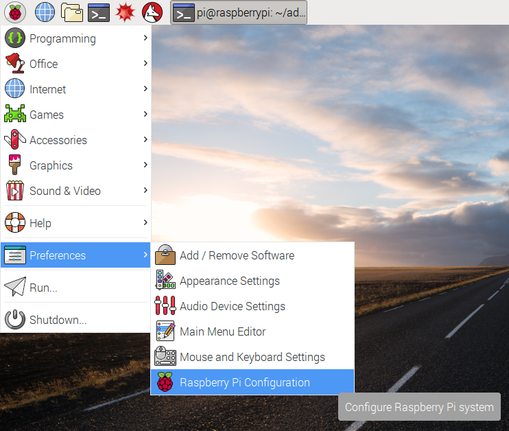

# Week 7: RPi Camera and Cognitive Service (Photo) 

Week 7 will focus on using the RPi Camera and will send photos and video to Azure's Cognitive Services for processing and analysis.

We are using the Raspberry Pi Camera (tested using Camera v2): [https://www.raspberrypi.org/products/camera-module-v2/](https://www.raspberrypi.org/products/camera-module-v2/)

## Setup the RPi Camera

Copyright photos: [RaspberryPi.org](http://www.raspberrypi.org)

Making sure your RPi is turned off and using the photo below as a reference, find the CSI port. Unlock the CSI port and put the camera module ribbon as shown below (blue part facing the ethernet port). 


Boot the RPi and update the configuration to enable the camera. You can do this with the desktop using a keyboard/monitor. Alternatively, if you don't have a screen and are SSH'ed into the Pi you can run `pi$ sudo  raspi-config` for similar settings.

Open from the main menu:

- Preferences > Raspberry Pi Configuration



From the menu that opens: 

- Interfaces > Set **Camera** to **enabled**


Now **reboot** your RPi and your camera will be ready for use.

## Using RPi from Terminal

Before we get engaged with the RPi Camera in code, let's use some CLI tools that can help us get a feel for the camera. 

We're going to use `raspistill` and `raspivid` to get a feel for our new camera. These should already be installed on your RPi with a Raspbian install.

Alternatively, if you have a USB webcam you can use the `fswebcam` and `avconv` by using:

```bash
# Only for USB webcams
pi$ sudo apt-get install fswebcam
pi$ sudo apt-get install avconv

# Use "fswebcam" for still to replace "raspistill"
# Use "avconv" to replace "raspivid"
#   Usage: avconv -t -10 -f video4linux2 -i /dev/video0 video.avi
```

Let's take a simple photo! I would advise using your RPi monitor connected to review images we save. However if you have syncing with the RPi you can load up the photos/videos locally on your host machine.

**Create a directory to store your work**

```bash
~/week7:pi$ mkdir images
~/week7:pi$ cd images 
```

**Take a photo and output to a file**

```bash
~/week7/images:pi$ raspistill --output img1.jpg 
```

Awesome, the file will be located at `img1.jpg` within your present working directory (i.e. `~/week7/images`). Notice that with the `-o` option we specified the output file name. You can change the name to anything you want for future photos. 

The camera module (v1) can take 5 megapixel photos at up to `2592 x 1944`, the camera module (v2) can take 8 megapixel photos at up to `3280 × 2464`. Most images will be about 3 MB in file size.

There are plenty of options you can add to `raspistill` command that are helpful. 

Reference the full list of options by typing `pi$ raspistill` with no arguments. Notice that most commands in a CLI can be shortened.

The next command will use a few in combination to demonstrate.

**Take photo with advanced options**

The following command will take a photo in 3 seconds, rotate the camera to 270 degrees, and output the photo to a file in the directory as `img_<TIMESTAMP>.jpg`

**Note**: Adjust the value of `--rotation` option to suit your camera's placement. It may not even need it.

```bash
~/week7/images:pi$ raspistill --rotation 270 --output img_%d.jpg --timestamp --timeout 3000
```

Let's break down the command:

- `raspistill`:  the CLI (command line interface) that interfaces to the camera.
- `--rotation 270`: specifies a degree to rotate the camera, in this case 270 degress because my camera was titled the other way, so I needed to compensate. There are other commands that are more simple if you need to compensate like `-vf` or `-hf` for vertical flip or horizontal flip, respectively.
- `--output img_%d.jpg`: defines a filename to save to disk, in this case we've add an output format that other options can use (e.g. `--timestamp` or `--datetime`)
- `--timestamp`: replace the output pattern (`%d`) with Unix timestamp (seconds since epoch).
    - Alternatively, you can switch this to `--datetime` to human readable time.
- `--timeout`: Time (in milliseconds) before the camera module takes a picture and shuts down the application (if not specified, the default is 5 seconds). In this case, we have set it to 3000 milliseconds (or 3 seconds).
    - You can supplement this with `--keypress` if you want user input to fire the command. The camera is run for the requested time (`--timeout`), and a capture can be initiated throughout that time by pressing the `Enter` key. Pressing `X` then `Enter` will exit the application before the timeout is reached. If the timeout is set to `0`, the camera will run indefinitely until the user presses `X` then `Enter`. Using the verbose option (`-v`) will display a prompt asking for user input, otherwise no prompt is displayed.

**Take multiple photos over a time period**

The following command will take take 4 photos over a 20 second period and output each file as `img_<FRAME_COUNT_NUMBER>.jpg`. Let's 

```bash
~/week7/images:pi$ raspistill --rotation 270 --output  img_%03d.jpg --timelapse 5000 --timeout 20000 
```

The `%03d` is a custom formatted date/time that says we expect a 3 digit number and we want leading zeroes to fill up empty places. For a full reference of what's accepted, you can view: [strftime - format date and time](http://man7.org/linux/man-pages/man3/strftime.3.html)

The option `--timelapse` allows us to take a photo at an interval we set in milliseconds, so in this case, we are taking a photo every 5 seconds (or 5000 ms).

Within your folder you should see: `img_001.jpg`, `img_002.jpg`, ... and so forth. There will also be a `img_000.jpg` for some reason I can't quite figure out!

**Take video**

Just like we did with `raspistill` we can use `raspivid` command to record video and save it to our RPi. 

Let's make a new folder under `week7` called `videos`

```bash
~/week7:pi$ mkdir videos
~/week7:pi$ cd videos
```

Now we can make our first video! We'll record for 10 seconds, output to a file, and put the preview mode to full screen (while rotating to fit my camera -- change according to your camera setup).

```bash
# with a rotation
~/week7/videos:pi$ raspivid --output video_1.h264 --timeout 10000 --fullscreen --rotation 270

# without rotation
~/week7/videos:pi$ raspivid --output video_1.h264 --timeout 10000 --fullscreen
```

To play the video, we'll use another CLI utility called `omxplayer`.


```bash
~/week7/videos:pi$ omxplayer video_1.h264
```

The video should play, it may be a little faster than when it was recorded because `omxplayer`'s fast frame rate.


## Raspberry Pi Camera in Python

Great, we have experimented with the camera, let's go ahead and use the RPi Camera in Python using the `python-picamera` library.

The `picamera` Python module should already be installed on your system, if not please install it by: `pi$ sudo apt-get update && sudo apt-get install python-picamera`

**Turn on preview**

Create a new Python file called `camera_test.py` in your current folder.

```python
from picamera import PiCamera
from time import sleep
import time

camera = PiCamera()

camera.start_preview()
sleep(20)
camera.stop_preview()
```

This will show us the preview of the camera for 20 seconds. This only works if you have a monitor connected, it will not work with `SSH` or `VNC`.

If you needed to do a rotation because of how your camera is setup, you can modify the rotation similar to what we did in the CLI.

Add the following line before the preview starts.

```python
...
camera.rotation = 180
camera.start_preview()
...
```

**Take a photo**

```python
from picamera import PiCamera
from time import sleep
import time

camera = PiCamera()
camera.rotation = 270

camera.start_preview()

# Wait for light to adjust
sleep(3)

# Set a timestamp
timestamp = int(time.time())

# Add a filename with a timestamp
filename = "img_{}.jpg".format(str(timestamp))
camera.capture(filename)

camera.stop_preview()

print 'File has been stored as: {}'.format(filename)
```

**Record video**

The following code will record 10 seconds of video and then close the program.

Create a new file called `camera_video.py` and paste the following code.

```python
from picamera import PiCamera
from time import sleep
import time

camera = PiCamera()
camera.rotation = 270

camera.start_preview()

# Add a filename with a timestamp
timestamp = int(time.time())
filename = "video_{}.h264".format(str(timestamp))
camera.start_recording(filename)
sleep(10)
camera.stop_recording()
camera.stop_preview()

print 'File has been stored as: {}'.format(filename)
```

## Port app code to Docker containers, uploading images/videos to cloud storage, and creating a Flask app using Camera module and mobile

This part will be an in-lab session. Reference files within `lab`.

We will create a Storage Account, Create a Container, and define "blobs" for upload.


We will confirm our success to cloud storage using: [Storage Explorer](http://storageexplorer.com/)

Parts of the live coding session will be:
- Using the code we used here inside Docker containers. We will go over the code and add an `takeVideo()` function.
- Setting up a Storage Account, defining a container name, and understanding where your accounts keys are, setting public policies.
- Using [Storage Explorer](http://storageexplorer.com/) to view blobs from Azure Storage Blob Service
- Adding a Flask server to make API requests to the container
- Adding API request from Mobile App
- Use Azure Cognitive Service: Computer Vision to see what's in a photo

## Hacker edition: Motion Detector

You'll need a Passive Infrared (PIR) motion sensor to continue, you can follow this guide to get you on your way: [https://www.raspberrypi.org/learning/parent-detector/worksheet/](https://www.raspberrypi.org/learning/parent-detector/worksheet/)