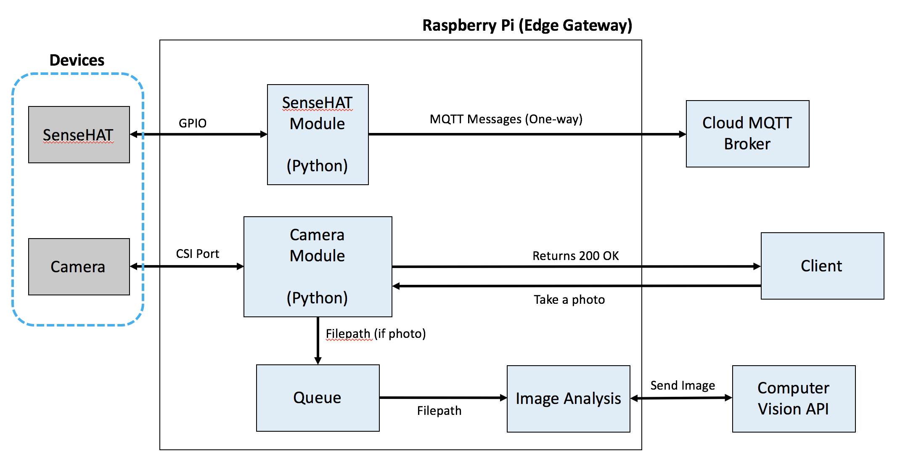

# Week 9: End-to-End Integration Part 2 and Data Analysis/Storage

This class will provide all the groundwork to provide an end-to-end IoT solution. This will enable you to standup at any time in the future your own configuration.

All the resources are broken into two sub-folders: `rpi-code` and `cloud-code`. 


## Raspberry Pi Code

Docker containers provide the foundation for our applications hosted on the RPi. We will walk through each code piece as if it were a new RPi. 

The sub-folder `rpi-code` contains all the resources and links we require to setup our RPi to do the following:

- Camera capture (image and video)
    - aka CentralCamera
- Image processing
    - aka CentralVision
- SenseHAT sensor readings
    - aka CentralSensor

The RPi should have the following commands installed: `docker` and `docker-compose`. If they are not, run the following from your Home directory (i.e. `~/`):

```bash
# Install Docker on RPi
pi$ curl -sSL https://get.docker.com | sh

# Add docker to a non-root user
pi$ sudo usermod -aG docker pi

# Install docker-compose
pi$ wget https://bootstrap.pypa.io/get-pip.py
pi$ sudo python get-pip.py
pi$ sudo pip install docker-compose
```

*Note*: This assume you have enabled your Camera.

### Architectural Overview

The RPi is acting as an Edge Gateway, receiving and sending data to sensors and actuators. The following architecture shows our devices (SenseHAT and Camera), our application code we use for transforming/analyzing our data, and connections to our cloud services.



*A few notes to highlight*:

- In a production setting, you may not use a `docker-compose.yml` file exactly, but may use something similar like a Kubernetes manifest file for instance. Both files describe how a group of containers that depend on each other should be instantiated, configured, and communicate. In our scenario (for simplicity's sake) we are adding all our containers regardless if they depend on each other or not. In a production environment, you'll only launch containers together if they rely on each other (as grouped containers they are deployed to the same host). Containers which don't rely on each other should be instantiated independently to avoid unnecessary coupling. 
- The Cognitive Services API allows for image analysis by directly sending the image as a payload in the `POST` request. In our scenario, we are uploading the image to Blob Storage, then posting The reason for us using a Queue between two containers is to see a common practice for communication between containers.
- In the future, you may see cloud providers who have Edge projects (AWS Greengrass or Azure IoT) who will push more compute to the edge. For instance, you will likely start seeing Machine Learning, Filtering, and other analytics applications pushed to the edge to process at the edge without using the cloud. 

## Base IoT Image

We need a base Docker image that we can build from as well as use for future projects/capstone. All the applications we are using on the RPi are using Python 2.7 - so our base image should include that. It should also allow us to use MQTT, Azure SDK, Camera/SenseHAT SDK.  

To save time, I have already built a base UW IoT image. The base Docker image we will use can be found at [Docker Hub - richardjortega/uwiot-rpi-baseimage](https://hub.docker.com/r/richardjortega/uwiot-rpi-baseimage/)
. A description of what was installed within the image can be found at the link (or by reading `rpi-code/uwiot-rpi-baseimage/Dockerfile`).  This will be downloaded automatically for you. 

*Note*: If you would like to build the base image from scratch (not recommended), you can reference the included file `rpi-code/uwiot-rpi-baseimage/buildAndPush.sh`

*Note 2*: If you would like to pull down the base image and retag it. You can reference the file: `rpi-code/uwiot-rpi-baseimage/pullAndPush.sh`. If you use this file you will need to modify the `FROM` line within the `Dockerfile` for both `centralcamera` and `centralsensor`.

## Setting up Raspberry Pi Services

Let's download the base image while we create other images (e.g. camera and SenseHAT) with your Docker Hub username and push those to your Docker Hub.

Set your environment variables the containers will use within the file  `.env`, `docker-compose` can use. Copy the `.env.example` file to `.env` and configure it. If you typed `ls` into the command line and didn't see the file, use `ls -al` to see all files in list format.

```bash
pi:~/week9/rpi-code$ cp .env.example .env
```

Edit the `.env` file in your favorite editor and only update the `DOCKERHUB_USERNAME` environment variable. Setting it to your Docker Hub username (e.g. `DOCKERHUB_USERNAME=<your_dockerhub_username>`)

Now let's build the images and push them Now that you've built and tagged your images, you can instantiate them now.

```bash
pi:~/week9/rpi-code$ docker-compose build
pi:~/week9/rpi-code$ docker-compose push
pi:~/week9/rpi-code$ docker-compose up
```

Let's deep dive into each service.

## Central Camera

App Location: `~/week9/rpi-code/centralcamera`

The camera module has been upgraded with a server-side API. We are now using a Flask server to control the camera. 

To take a photo, go to your host machine and launch your browser of choice:

`http://<YOUR_RASPBERRY_PI_IP_ADDRESS_OR_HOSTNAME>/take_photo`

To take a video, go to your host machine and launch your browser of choice:

`http://<YOUR_RASPBERRY_PI_IP_ADDRESS_OR_HOSTNAME>/take_video`

It has been setup in a generic way, purposefully minimal, so you can add/remove your own logic for your capstone project (if you choose to use it). For instance, you could add a `timeout` parameter and use Flask to parse that parameter to use in your function dynamically.

Additionally, there are other tools you can use to access your web server like [Postman](https://www.getpostman.com/) or [cURL](https://curl.haxx.se/docs/manpage.html).


## Cloud Code


### Azure CLI (local or Azure Cloud Shell)

Run the following commands within Azure Cloud Shell. The Azure Cloud Shell is a free Bash shell that you can run directly within the Azure portal. It has the Azure CLI preinstalled and configured to use with your account.  You can also run these on your host machine with the following link: [Install Azure CLI 2.0](https://docs.microsoft.com/en-us/cli/azure/install-azure-cli). If you use the Azure CLI 2.0 from your host machine, make sure that you run `az login` prior to running any commands.

The Cloud Shell looks like this within the Azure Portal:


The button launches an interactive shell that you can use to run all of the steps in this topic:


Sign in to your Azure account and select your subscription.

### Deploy Resources

The `deploy.sh` (found within the folder: `cloud-code`) will deploy all necessary resources.

To run the command *(if running Azure CLI 2.0 on host machine)*:

```bash
host$ cd cloud-code
host$ ./deploy.sh
```

To run the command *(if using Azure Cloud Shell)*:

```bash
cloudshell$ wget path/to/deploy
cloudshell$ chmod +x deploy.sh
cloudshell$ ./deploy.sh
```

### Destroy Resources

To ensure you're not wasting spending any cloud resources after class you can destroy all resources within the resource we created.

The `destroy.sh` (found within the folder: `cloud-code`) will deploy all necessary resources.

To run the command *(if running Azure CLI 2.0 on host machine)*:

```bash
host$ cd cloud-code
host$ ./destroy.sh
```

To run the command *(if using Azure Cloud Shell)*:

```bash
cloudshell$ wget path/to/destroy
cloudshell$ chmod +x destroy.sh
cloudshell$ ./destroy.sh
```